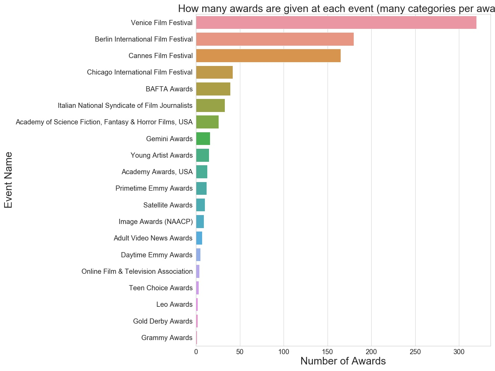
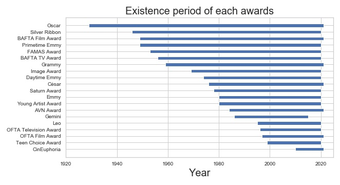
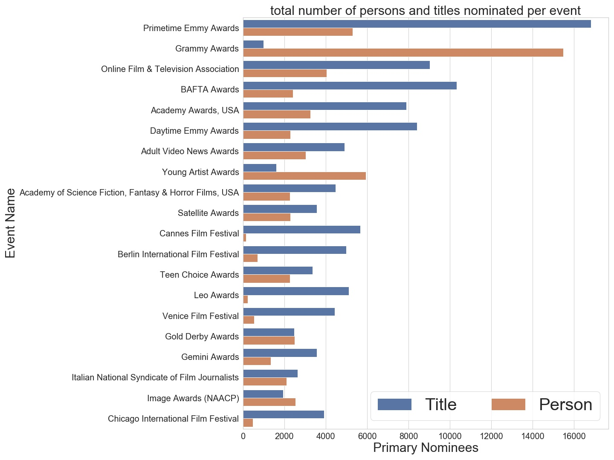
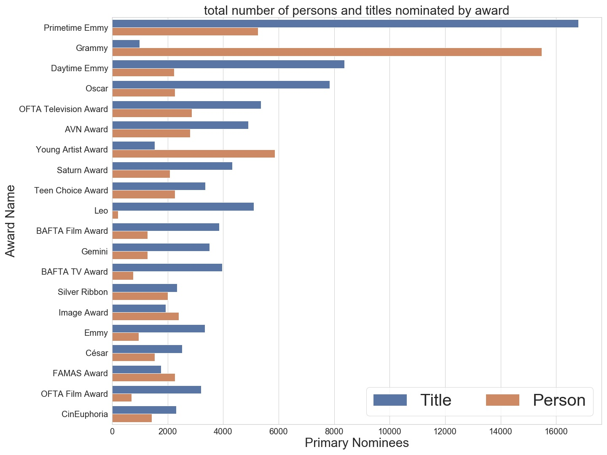

# Project of Data Visualization (COM-480)

| Student's name | SCIPER |
| Yann Yanis Bouquet | 273827 |
| Emma Lanctuit | 274894 |
| Gonxhe Idrizi | 275001 |

[Milestone 1](#milestone-1-friday-3rd-april-5pm) • [Milestone 2](#milestone-2-friday-1st-may-5pm) • [Milestone 3](#milestone-3-thursday-28th-may-5pm)

## Milestone 1 (Friday 3rd April, 5pm)
**10% of the final grade**
### 1.1. Dataset

A first dataset we will explore is the film Award from IMDB which contains awards from 1886 to 2020. As our project will focus on an evolution through time, having such a range of data will be useful but we have to consider disparity due to event existence. What is the existence period of each event pre-selected to these days?

Most frequent and relevant events in the dataset are, by preprocessing: Emmy Awards, BAFTA Awards, Academy Awards (USA), News & Documentary Emmy Awards, Online Film & Television Association, Grammy Awards, Cannes Film Festival, Gold Derby Awards, Berlin International Film Festival, Gemini Awards, Leo Awards, Adult Video News Awards, Young Artist Awards. We notice a distinction between the Event and Award names as some awards names might be more meaningful than their associated events. If we take the Oscar for exemple, theses are awards delivered during the Academy Awards. This is a nuance that we will have to investigate in order to make our visualization as relevant as possible. How many awards are there per event?

This dataset also contains distinction between primary and secondary prices. For the scope of our visualisation we retain only primary prizes awarded to film or people. In order to have an unbiased result, we are also interested in the proportion of nominees or winners for each of the ceremonies selected for our study (i.e. most frequent/popular). How much information we lose if we reduce our study to the winners?

To join awards information with movies country production we are using the dataset of IMDB Movies that contains around 80 000 films. Since our study period extends over a century, we have to manually change the names of countries that no longer exist as Soviet Union for Russia, West Germany for Germany… We hope that the majority of the films/persons nominated in the most popular ceremonies of the last 100 years will be present in this dataset. In this purpose, as we are distinguishing nominations from their country-production aspect it can be interesting to know : How many movies are represented by country in the IMDB dataset? A country not present in this dataset will most likely not be represented in our visualization.

Link to datasets:
[IMDB Awards](https://www.kaggle.com/iwooloowi/film-awards-imdb)
[IMDB Movies](https://www.kaggle.com/stefanoleone992/imdb-extensive-dataset)

### 1.2 Problematic

Through a cinema perspective, we aspire to analyse general movies trends over time and by country.
With our visualization, we will show the distribution of the country of production of the film awarded with the most famous ceremonies throughout time. It is an attempt to capture by country a certain trend of cinematographic interest of its population, these productions and then their international renown over a century.
Today there are many film awards and, from the point of view of countries, the fact that a film is awarded or nominated increases the country's international influence. Obtaining an award widens the audience, leading to a better knowledge of a specific country or the desire to discover it. An award is of course a considerable price for directors, actors, actresses and all the team involved but also for the country who hosts it.

Ireland and Croatia are examples of those countries that have seen their tourists number explode thanks to the famous “Game of Thrones” series. New Zealand recorded a 40% increase in tourism between 2000 and 2006 with his “Lord of the Rings”, notably the town of Hobbiton. Moreover Kazakhstan just after “Borat” with a 300% increase in tourism. There is also Marseille in France with “Plus Belle la Vie”, Miami in USA with “Dexter”, Albuquerque with “Breaking Bad”, Tunisia with “Stars Wars” and many others.

So who are theses countries that observe new tourism trends from cinematographic recompenses? How do they evolve over time?

Extending our questioning to film categories, we can imagine that some categories will have greater chance of being nominated at specific ceremonies (depending on the award category) but is it true? Our visualisation will show the distribution of film categories through ceremonies or countries over time. Since many awards are based on public audiences or are followed by a general improvement in public interest in the film, we can assume that the proportion of films nominated in the categories through ceremonies influences the current film trends of the population. A blockbuster will be screened worldwide and therefore contributes to increase the appeal of a particular genre. This is even more convincing for series, as many countries begin to debate and watch the same world series for a period of time. “Game of Thrones” can be again a good example of this correlation between awards and audience as they have 16.1M of spectator 38 Emmy Awards and 129 nominations.

If such a correlation is confirmed, can we observe that a film-producing country is gradually changing the type of film it hosts in order to have better audiences?  
Our goal is to make a visualisation where all theses questions can be answered. It could be a new tool for trends analysis by considering film prices as country indicators. It can help the director to better choose where to present his film according to its category and home production.
Moreover, it can be a simple curiosity for a cinema-lover or anybody looking for new visualisation of the world of film awards.

### 1.3 Exploratory Data Analysis

During our dataset analysis, multiple questions were raised that we tried to answer through some visualisations of our data. There is two main endpoints in our visualisation : Film-producing countries and Events/Awards.
We have to decide whether to consider the event or its awards as it changes the access to our visualization. We need a name that speaks to the largest number of people and at the same time makes sense from the point of view of our cinematic study. Considering the event rather than the award leads to a difference in the selected ceremonies and therefore in the total distribution of our countries. This is a major decision in the relevance of our final visualization.
How many awards are there per event?

Our next analysis concern the feasibility of our visualisation considering one century of evolution over Cinema Awards.
What is the existence period of each event pre-selected to these days?

We observe that we should have enough data to cover all the century in a representative way. Note that awards followed the repartition of event as expected. Moreover some name coincides and taking the awards instead of event name doesn’t seems to include any biais here.

Having relevant visualisation imply to use relevant data. Is it pertinent to consider winners and nominees, can we reduce our sample to winners as there are the most impacted by an award?
How much information we lose if we reduce our study to the winners?

By events:

By awards:

Here again the distinction between events and awards doesn’t seem to have a notable impact on our data repartition. However we saw that we are losing a huge part of data by only selecting winners. Keeping both remains appropriate to our goal since a nominated film will still have more visibility than one without a price.

An overview of the biases that could be included by considering only nominated films and not people was also an important subject. This would make it easier for us to match the actor's nomination with the country of production of the film in which he or she was nominated.

Proportion film/person nominated by events

Proportion film/person nominated by award

From this visualisation, we get that one more time the distinction between awards or event doesn’t change the global repartition. This confirm us in the fact that most popular awards are linked to most popular events. However is show us that by deleting people from our study we risk considerably influencing the total distribution of awards and thus our countries of production.

As we link our award dataset to our film dataset in purpose to match award to film-producing country, we have to make sure that we have enough countries represented in our IMDB dataset to conduct an interesting study.

How many movies are represented by country in the IMDB dataset?

### 1.4 Related work
Most data visualizations concerning Film ceremonies are on discrimination between sexual genre. They often focus on a single ceremony (Grammy Awards or Oscar) and try to show existing discrimination (female/mal, racial...).
Some others focus on predictive task : who will win depending on their previous nomination in the same ceremonie, what is the value of an Award (financial gain) or which are actors that are the most popular and without Award.
Movies Awards impact have been covered from people, film perspective even from production house (as Disney, Warner Bros, Paramount…) but never from a country perspective.

Our original approach is that we are not focusing on a particular ceremony but one the geographical repartition of nominees films home production. Our visualisation is an attempt to point out the repartition of countries emerging from film award over a century. This analyse of film award seems to have never been considered and we have found interesting to investigate more on this track.
Our visualisation will be our conclusion of our investigation.

In creating this visualization, our first thought was of course to use a planisphere. We wanted to symbolize the links between film ceremonies and countries of production through flows. However, we soon realized that the concentration of ceremonies in the United States made this visualization difficult. Moreover, one of the largest countries of production being the United States, we found it difficult to symbolize this loop.

So we thought we would abstract the location of its events and focus on the links between countries and popular ceremonies. We can also consider grouping its countries by continent by giving them the same color. All the details of the visualization remain to be decided but here below are some sources of our inspiration.

We can distinguish them in two classes:
- Our general visualization consisting of the distribution of the films awarded at the ceremonies by country of production over a century.  

Main visualisation animated over a century
- Animated version of film-producing country map to ceremonies [here](https://66.media.tumblr.com/tumblr_m54xq7uZ6u1rudy45o1_1280.jpg)
- Creation of layers : 1 by country you have the proportion by film categories and then the proportion by ceremonies. Flow by country captured in the color [here](https://twitter.com/cesifoti/status/600649485312761856/photo/1)
- Country on the left, categories, flow to commun cinema space and then redistribution over ceremonies (yellow here) [here](https://www.behance.net/gallery/21476567/Data-Visualisation-Art-Direction-(Oscar-Huerta))

- Our study on the evolution of the prize-winning categories by ceremony or country of production over time. The analysis by country aims to visualize potential changes within a country as a result of the tourism spin-offs of a film nomination. Ceremonial analysis focuses more on capturing general trends in the appeal of a particular film genre to the general public.

Visualisation of film categories changes over a century by country:
- Animated visualisation over time, the interest of the visualisation is that the countries order is changing depending on the detected cases evolution [here](https://www.instagram.com/p/B-Z2WEVoS7Y/)
Visualisation of film categories change throughout time by ceremonies:
- Simple animated diagram focusing on global film categories name or a one letting us add some secondary informations for a proportion of nomination for exemple [here](https://www.pinterest.fr/pin/281263939211265519/?d=t&mjt=login)

We haven’t used any of these datasets before.

### 1.5 Sources
[Article on touristic place from films/series](https://www.cafedeclic.com/article/13-endroits-devenus-tres-touristiques-grace-a-un-film-ou-une-serie/)
[Article on Game of thrones statistics](https://geeko.lesoir.be/2019/04/06/10-chiffres-fous-sur-game-of-thrones/)
[Data visualisation on Oscar prediction](https://towardsdatascience.com/predicting-the-oscars-with-data-viz-e5bb0fd01766)
[Data visualisation on how to win an Oscar](http://blog.dasheroo.com/data-visualization-how-to-win-an-oscar/)

## Milestone 2 (Friday 1st May, 5pm)

**10% of the final grade**

## Milestone 3 (Thursday 28th May, 5pm)

**80% of the final grade**
